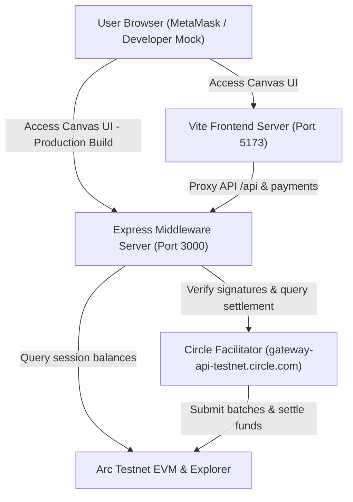
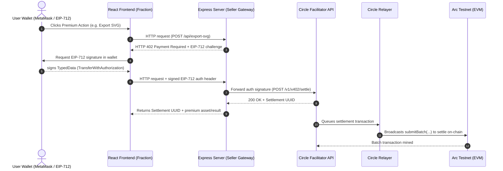

# Fraction — The Infinite Web3 Design Canvas

Fraction is a premium, vector-based infinite design canvas built on open Web3 micropayment standards. It allows designers and creators to draw, sketch, style, and outline layouts for free, paying only fraction-of-a-cent micro-USDC payments for premium operations (such as high-fidelity SVG exports and AI design audits). 

Powered by **Circle's x402 Nanopayment Protocol** and settled on **Arc Testnet**, Fraction demonstrates how frictionless, pay-as-you-go Web3 mechanics can replace recurring subscription models.

---

## 🏗️ System Architecture

Fraction connects a high-fidelity vector editing canvas with a local merchant middleware server, Circle's payment routing layers, and the Layer-2 Arc Testnet.



### 💸 Payment & Settlement Flow (x402 Protocol)

When a user triggers a premium feature (like exporting an SVG file or running an AI audit), the payment challenge, EIP-712 authorization, and batch execution follow this sequence:



---

## ✨ Features

- **Infinite Workspace**: Drag, pan, and zoom an infinite dotted vector canvas with hotkey navigation support.
- **Rich Vector Drawing Suite**: 
  - Standard shapes: Rectangles, Circles/Ellipses, Lines, Arrows, and Freehand Pen Drawing.
  - Text boxes & double-clickable sticky notes.
  - Image uploader (embeds custom image assets directly in the vector DOM).
- **Premium Properties Inspector**:
  - **Visual Color Palette**: Instantly change stroke and background colors using custom-designed circular color swatches.
  - **Stroke Width**: Choose stroke widths between 2px, 4px, and 8px.
  - **Border/Stroke Style**: Select between Solid, Dashed, and Dotted lines.
  - **Rounded Corners**: Customize the corner radius of rectangles (0px to 40px).
  - **Opacity Slider**: Fine-tune shape opacity from 10% to 100%.
  - **Font Size & Style**: Adjust font sizes (12px to 48px) and select fonts (Sans-Serif, Serif, Monospace, or Handwritten).
- **CSS Shader Filters**: Apply real-time visual effects (Grayscale, Sepia, Invert, Blur, Hue Rotation, Neon Glows, and Vibrant Contrast).
- **KIRO AI Design Auditor ($0.01 USDC)**: An on-canvas AI design agent that analyzes shape alignments, colors, and layouts using Llama-3 via OpenRouter, paid dynamically via EIP-712 authorizations.
- **Vector Export ($0.05 USDC)**: Pay a micropayment to generate and download a clean, high-fidelity SVG, PNG, JPEG, or JSON vector canvas markup.

---

## 📁 Repository Structure

```
├── .env.example         # Template for environment configuration
├── server.ts            # Express server (seller gateway and backend proxies)
├── decode-batch.ts      # Utility to decode on-chain submitBatch tx calldata
├── buyer.ts             # Developer CLI buyer (signs payments programmatically)
├── index.html           # Main SPA entrypoint
├── tailwind.config.js   # Style config
├── vite.config.ts       # Vite bundler, port and proxy setup
├── src/
│   ├── App.tsx          # Main React UI, modals, chat state, and Web3 logic
│   ├── CustomCanvas.tsx # Interactive SVG canvas, event handlers, and shapes
│   ├── index.css        # Design tokens, premium buttons, and base styles
│   └── main.tsx         # React DOM mount point
└── public/
    ├── buyer.html       # Independent, visual x402 payment tracer tool
    └── kiro.png         # AI Agent avatar asset
```

---

## 🚀 Getting Started

### 📋 Prerequisites

- **Node.js**: Version 20 or higher is required.
- **USDC Faucet**: An EVM wallet (e.g. MetaMask) funded with Arc Testnet USDC. Get free tokens from the [Circle Faucet](https://faucet.circle.com/).

### 🔧 Configuration

1. Copy `.env` or create it:
   ```bash
   touch .env
   ```
2. Populate the environment variables inside `.env`:
   ```env
   # OpenRouter API Key for the KIRO AI Canvas Auditor Agent
   OPENROUTER_API_KEY=your-openrouter-api-key-here

   # Canteen Arc Testnet RPC URL
   ARC_TESTNET_RPC=https://rpc.testnet.arc-node.thecanteenapp.com/v1/swrm_3e98784aef12ddb795b7025cbf883a53ca15fa76869353ca4fa132f3de3e9082
   VITE_ARC_TESTNET_RPC=https://rpc.testnet.arc-node.thecanteenapp.com/v1/swrm_3e98784aef12ddb795b7025cbf883a53ca15fa76869353ca4fa132f3de3e9082
   ```

### 💻 Installation

Install the node packages:
```bash
npm install
```

### 🏃 Running Locally

To run the application locally, start both the Express backend and the Vite frontend dev server:

1. **Start the Backend Server**:
   ```bash
   npm start
   ```
   *Runs the Express server on `http://localhost:3000`.*

2. **Start the Frontend Development Server**:
   ```bash
   npm run dev
   ```
   *Runs the Vite dev server on `http://localhost:5173`.*

3. **Open the Application**:
   Navigate to **`http://localhost:5173/?mock=true`** in your browser. 
   *(The `?mock=true` query parameter enables the built-in Developer Mock Wallet, allowing you to sign EIP-712 challenges and execute actions immediately without connecting MetaMask).*

### 📦 Building for Production

Compile the client bundle to static files:
```bash
npm run build
```
The compiled build output will be stored in `/dist`. The Express server (`npm start`) automatically serves this folder on `http://localhost:3000`.

---

## 🛠️ Developer Tools

### On-Chain Transaction Decoder (CLI)

The `decode-batch.ts` script allows you to unpack any `submitBatch` transaction hash from the Arc Testnet, extracting the underlying balance deltas, net transfers, and associated UUIDs:

```bash
npx tsx decode-batch.ts 0xfbad1baae7fd9b88f4e1b034a4236da02012870acbd6ae83b583e85528be396e
```

### EIP-712 Interactive Payment Tracer (Web)

With the server running, visit **`http://localhost:3000/buyer.html`** (or click the Payment Tracer links on the home page). This tool allows you to walk through the visual step-by-step lifecycle of an x402 payment, tracing the signature, facilitator queue status, and the final on-chain transaction.

---

## ⚠️ Contribution Policy

> [!WARNING]
> Please do **NOT** execute `git push` command sequences on this repository without explicit approval from the repository owner.
